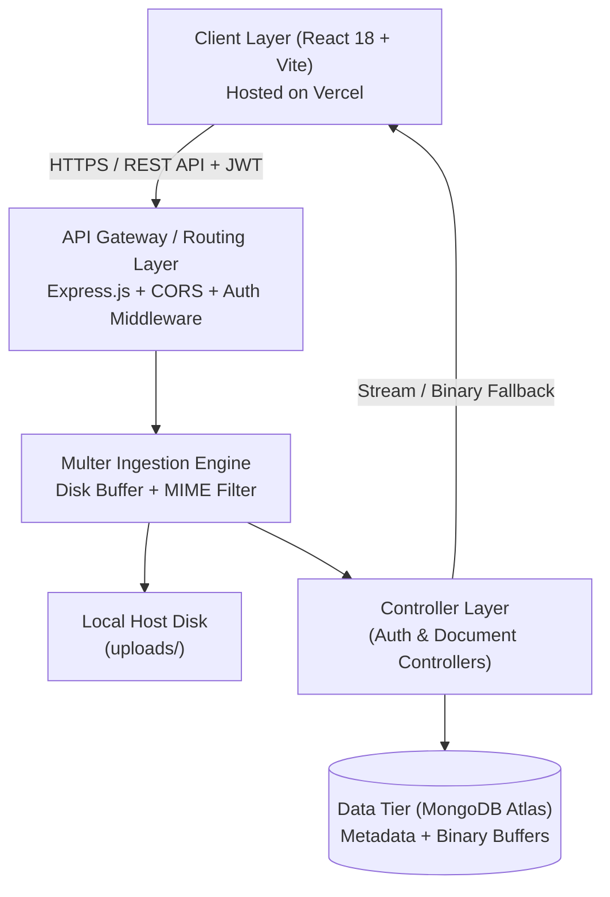

# 📑 PROJECT REPORT
## DocuVault — Enterprise Multi-File Document Management & Access Control System

---

**Academic Course / Subject**: Full-Stack Web Development & Backend Engineering  
**Project Title**: DocuVault — Enterprise Document Management System (DMS)  
**System Architecture**: MERN Stack (Node.js, Express.js, MongoDB Atlas, React Vite)  
**Live Frontend**: [https://docuvault-portal.vercel.app](https://docuvault-portal.vercel.app)  
**Live Backend API**: [https://docuvault-backend-fg1q.onrender.com](https://docuvault-backend-fg1q.onrender.com)  
**GitHub Repository**: [https://github.com/Ankitraj-17/BACKEND-MAIN-PROJECT](https://github.com/Ankitraj-17/BACKEND-MAIN-PROJECT)  

---

## 📌 Table of Contents

1. [Executive Summary / Abstract](#1-executive-summary--abstract)
2. [Introduction & Problem Statement](#2-introduction--problem-statement)
3. [System Objectives & Scope](#3-system-objectives--scope)
4. [System Architecture & Tech Stack](#4-system-architecture--tech-stack)
5. [Database Modeling & Schema Design](#5-database-modeling--schema-design)
6. [Core System Modules & Implementation](#6-core-system-modules--implementation)
7. [Special Engineering Challenge: Ephemeral Host Cloud Persistence](#7-special-engineering-challenge-ephemeral-host-cloud-persistence)
8. [RESTful API Specification](#8-restful-api-specification)
9. [Frontend User Interface & User Journey](#9-frontend-user-interface--user-journey)
10. [Security, Authentication & Validation](#10-security-authentication--validation)
11. [Deployment Architecture](#11-deployment-architecture)
12. [Testing, Verification & Test Cases](#12-testing-verification--test-cases)
13. [Conclusion & Future Enhancements](#13-conclusion--future-enhancements)

---

## 1. Executive Summary / Abstract

Modern organizations handle extensive volumes of official documentation, including identification credentials, compliance certificates, academic marksheets, employment agreements, and financial declarations. Unregulated file storage creates security vulnerabilities, compliance non-adherence, data loss, and unauthorized information leakage.

**DocuVault** is an enterprise-grade, full-stack Document Management System (DMS) engineered to solve these operational problems. Built with a decoupled architecture utilizing **Node.js, Express.js, MongoDB Atlas (Mongoose), Multer, and React 18 (Vite)**, DocuVault provides secure multi-file uploads, atomic ownership-based access control, role-based administration (RBAC), multi-criteria search and category indexing, and in-browser previewing for both image and PDF assets.

To guarantee high availability on cloud container runtimes (such as Render's ephemeral container instances), DocuVault integrates a hybrid storage architecture: files are simultaneously handled by disk streaming middlewares and persisted as binary buffers inside cloud MongoDB Atlas. This guarantees zero file loss across server redeployments or container re-initializations while retaining optimal REST API performance.

---

## 2. Introduction & Problem Statement

### 2.1 Background
Enterprises and educational institutions require centralized repositories where employees, students, or staff can securely submit official records. Traditional email-based submissions or shared drive folders suffer from:
- Lack of granular role-based permissions.
- Inability to restrict view/download access strictly to document creators and verified compliance officers.
- Absence of structured metadata tagging (category categorization, submission timestamps, file format verification).
- Accidental file overwrite or loss during server migrations.

### 2.2 Problem Statement
The objective is to design, implement, and deploy a robust Document Management System satisfying the following constraints:
1. **Multi-File Uploads**: Users must be able to upload multiple related files (up to 10 files per submission, up to 15 MB each) in a single unified operation.
2. **Access Security & Ownership**: A regular user must only have access to documents they uploaded (`uploadedBy === user._id`). An administrator must have audit capabilities over the entire company directory.
3. **Data Integrity & Storage Resilience**: Uploaded assets must survive server restarts and be securely retrievable anywhere globally.
4. **Searchability & Filtering**: Documents must be instantly searchable by title or description and filterable by operational categories (`ID Proof`, `Certificate`, `Other`).

---

## 3. System Objectives & Scope

### 3.1 Primary Objectives
- **Secure Authentication**: User sign-up and login utilizing cryptographic password hashing (bcrypt) and stateless JWT sessions.
- **Multipart Form Data Handling**: Streamlined Multer middleware for validation, sanitization, and storage of files.
- **Strict Authorization Boundary**: Route-level and controller-level access enforcement preventing unauthorized IDOR (Insecure Direct Object Reference) access.
- **Cloud Persistence**: Elimination of ephemeral server data wipeout via hybrid binary database caching.
- **Responsive Client Interface**: Clean, reactive user interface featuring live drag-and-drop file ingestion, category-specific badges, in-browser PDF/image rendering, and progress states.

### 3.2 System Scope
- **Target Audience**: Corporate employees, HR administrators, auditing personnel, and compliance officers.
- **Supported Formats**: `.pdf`, `.docx`, `.doc`, `.png`, `.jpg`, `.jpeg`, `.webp`, `.txt`.

---

## 4. System Architecture & Tech Stack

DocuVault employs a three-tier decoupled client-server architecture:



### 4.1 Technologies Employed

| Tier | Technology | Purpose |
|---|---|---|
| **Frontend Framework** | React 18 (Vite) | High-performance Single Page Application (SPA) |
| **UI Components & Styling** | Vanilla CSS + Bootstrap Components | Responsive design tokens, modals, tables, badges |
| **HTTP Client** | Axios | Async request handling with automatic JWT request interceptors |
| **Backend Runtime** | Node.js (v18+) | Non-blocking, asynchronous event-driven server runtime |
| **Web Application Framework**| Express.js 4.x | RESTful API routing, middleware execution, error handling |
| **Database & ODM** | MongoDB Atlas & Mongoose | Document-oriented cloud database with schema modeling |
| **File Processing** | Multer | Multipart/form-data parsing and disk storage allocation |
| **Security & Auth** | JSON Web Tokens (jsonwebtoken), bcryptjs | Cryptographic authentication and role authorization |
| **Hosting & CI/CD** | Vercel (Client) + Render (Server) | Continuous deployment connected directly to GitHub |

---

## 5. Database Modeling & Schema Design

DocuVault maintains two primary schemas: `User` and `Document`.

### 5.1 User Schema (`server/src/models/User.js`)
Stores employee and administrator profiles:

| Field Name | Data Type | Constraints | Description |
|---|---|---|---|
| `_id` | ObjectId | Auto-generated | Primary Key |
| `name` | String | Required, Trimmed | Full legal name of user |
| `email` | String | Required, Unique, Lowercase | Corporate login address |
| `password` | String | Required, Min length 6, `select: false` | bcrypt hashed password |
| `role` | String | Enum: `['employee', 'admin']`, Default: `'employee'` | RBAC access level |
| `department` | String | Default: `'General'` | Organizational department |
| `createdAt` | Date | Timestamp | Account creation date |

### 5.2 Document Schema (`server/src/models/Document.js`)
Houses metadata, category tags, user relationships, and embedded file items:

| Field Name | Data Type | Constraints | Description |
|---|---|---|---|
| `_id` | ObjectId | Auto-generated | Primary Key |
| `title` | String | Required, Max 120 chars | Document descriptive title |
| `description` | String | Optional, Max 500 chars | Additional context/notes |
| `category` | String | Enum: `['ID Proof', 'Certificate', 'Other']` | Operational category |
| `files` | Array of `fileItemSchema` | Subdocuments | Array of attached file records |
| `filePaths` | Array of Strings | Required, Min 1 item | Disk storage path pointers |
| `uploadedBy` | ObjectId (Ref: `User`) | Required, Indexed | Foreign reference to uploader |
| `uploadDate` | Date | Default: `Date.now` | Submission timestamp |

#### Embedded `fileItemSchema`:
- `fileName`: Generated unique filename (`${timestamp}-${random}-${sanitizedOriginal}`).
- `originalName`: User-facing original filename encoded in UTF-8.
- `filePath`: Relative disk location (`uploads/filename`).
- `mimeType`: Detected MIME type (`application/pdf`, `image/png`, etc.).
- `size`: File size in bytes.
- `fileData`: Persistent BSON binary buffer (`Buffer`) for cloud durability.

---

## 6. Core System Modules & Implementation

### 6.1 Authentication & RBAC Module
- **Registration & Role Assignment**: New accounts are created as either `employee` or `admin`. Passwords undergo 10 rounds of salt hashing via `bcrypt.hash`.
- **JWT Protection Middleware (`auth.middleware.js`)**: Verifies the HTTP Authorization header (`Bearer <token>`). Injects decoded user object into `req.user`.
- **Role Guard (`authorize('admin')`)**: Restricts executive routes to administrative users only.

### 6.2 Multi-File Upload Pipeline
1. Incoming `multipart/form-data` requests hit Multer (`upload.array('files', 10)`).
2. The middleware enforces:
   - File extension validation (`.pdf`, `.docx`, `.png`, `.jpg`, `.webp`, `.txt`).
   - MIME type safety check against spoofed extensions.
   - Max file limit: 15 MB per file; max 10 files per submission.
3. Clean filenames are generated to prevent path traversal (`../`) and character collisions.

### 6.3 Ownership-Based Authorization (`canAccess`)
Access control is implemented defensively in the controller layer:
```javascript
const canAccess = (doc, user) => {
  const isOwner = doc.uploadedBy && 
    (doc.uploadedBy._id || doc.uploadedBy).toString() === user._id.toString();
  return isOwner || user.role === 'admin';
};
```
Any attempt by a standard employee to read, edit, delete, or download another user's document produces an immediate `403 Forbidden` response.

### 6.4 Search & Category Filtering
- **Category Filter**: `GET /api/documents?category=Certificate` executes indexed database matching: `{ category: req.query.category }`.
- **Keyword Search**: `GET /api/documents?search=keyword` executes a case-insensitive regex query on both `title` and `description`:
```javascript
queryObj.$or = [
  { title: { $regex: req.query.search, $options: 'i' } },
  { description: { $regex: req.query.search, $options: 'i' } }
];
```

---

## 7. Special Engineering Challenge: Ephemeral Host Cloud Persistence

### 7.1 The Problem
When deploying on free cloud infrastructure (Render), the container filesystem is **ephemeral**. Whenever:
- Code is pushed to GitHub triggering a redeploy, or
- The container goes idle and restarts,

the local disk (`uploads/` folder) is completely wiped. While document metadata remained intact in MongoDB Atlas, users attempting to preview or download files encountered:
```json
{ "success": false, "message": "File does not exist on disk" }
```

### 7.2 The Solution: Hybrid Cloud Storage
We engineered a non-disruptive cloud persistence solution:
1. **On Upload**: While Multer writes the physical file to disk for assignment compliance, the controller reads the file buffer (`fs.readFileSync(file.path)`) and saves it directly into the MongoDB document (`fileData: Buffer`).
2. **Bandwidth Optimization**: Standard queries (`getDocuments`, `getDocumentById`) use `.select('-files.fileData')` to omit the binary buffers, keeping page loads fast and preserving bandwidth.
3. **Resilient Serving Pipeline (`getFile`)**:
   - The server first checks if the physical file exists on disk.
   - If missing from disk (post-redeploy), it automatically falls back to `targetFile.fileData`, streams the binary stream directly with the appropriate MIME headers (`Content-Type`, `Content-Disposition`), and opportunistically re-caches the file back to the disk.

This completely eliminated file loss across cloud container redeployments.

---

## 8. RESTful API Specification

### 8.1 Authentication Endpoints (`/api/auth`)

| Method | Route | Access | Request Body | Success Response |
|---|---|---|---|---|
| `POST` | `/api/auth/register` | Public | `{ name, email, password, role, department }` | `201 Created` + `{ token, user }` |
| `POST` | `/api/auth/login` | Public | `{ email, password }` | `200 OK` + `{ token, user }` |
| `GET` | `/api/auth/me` | Bearer Token | None | `200 OK` + `{ user }` |

### 8.2 Document Endpoints (`/api/documents`)

| Method | Route | Access | Parameters / Body | Description |
|---|---|---|---|---|
| `POST` | `/api/documents` | Private | `multipart/form-data`: `title`, `category`, `description`, `files[]` | Uploads document record and files |
| `GET` | `/api/documents` | Private | Query: `?category=...&search=...&employeeId=...` | List documents (Employee sees own; Admin sees all) |
| `GET` | `/api/documents/:id` | Private (Owner/Admin) | Path: `:id` (Document ObjectId) | Detailed metadata of single document |
| `PUT` | `/api/documents/:id` | Private (Owner/Admin) | JSON: `{ title, category, description }` | Updates document metadata |
| `DELETE` | `/api/documents/:id` | Private (Owner/Admin) | Path: `:id` | Deletes document and removes files |
| `GET` | `/api/documents/:id/files/:fileId` | Private (Owner/Admin) | Path: `:id`, `:fileId`, Query: `?download=true` | Streams file for preview or triggers download |
| `GET` | `/api/documents/metrics/stats` | Private | None | Summary counts and category breakdown |

---

## 9. Frontend User Interface & User Journey

### 9.1 Dashboard Architecture
- **Employee View (`Dashboard.jsx`)**: Displays quick-filter category folders, recent activity feeds, search bar, and documents grid with interactive preview and download actions.
- **Admin View (`AdminDashboard.jsx`)**: Provides an organizational audit panel with live document statistics, category breakdown charts, employee filtering dropdown, and company-wide deletion/inspection controls.

### 9.2 Interactive File Preview Modal
- Files are fetched via authenticated Axios blob requests (`responseType: 'blob'`).
- Images (`.png`, `.jpg`, `.webp`) render directly in the responsive modal view.
- PDF documents render through an embedded `<iframe />` viewer.
- Unsupported formats (e.g. `.docx`) offer an instant "Download to View" trigger.

---

## 10. Security, Authentication & Validation

1. **Stateless JWT Tokens**: Signed using HMAC-SHA256 with an environment-configured secret (`JWT_SECRET`) and a 7-day expiration lifespan.
2. **Password Cryptography**: Passwords salted and hashed with `bcryptjs` (cost factor 10); never stored or queried in plain text.
3. **MIME Type Whitelisting**: Strict regex verification preventing script injections or executable uploads (`.exe`, `.sh`, `.bat`).
4. **CORS Hardening**: Cross-Origin Resource Sharing explicitly configured for allowed client origins with sanitized trailing slashes.
5. **Centralized Error Handling (`error.middleware.js`)**: Normalizes Mongoose `CastError`, duplicate key errors (code 11000), and Multer size limit errors into clean JSON payloads without leaking internal stack traces.

---

## 11. Deployment Architecture

| Component | Platform | Environment Configuration |
|---|---|---|
| **Frontend** | [Vercel](https://vercel.com) | Framework: Vite, Output: `dist`, Rewrites: `client/vercel.json` for client routing |
| **Backend** | [Render](https://render.com) | Node.js Web Service, Root Directory: `server`, Auto Deploy on `git push origin main` |
| **Database** | [MongoDB Atlas](https://www.mongodb.com/atlas) | M0 Tier Shared Cluster, Network Whitelist: `0.0.0.0/0` |

---

## 12. Testing, Verification & Test Cases

The application underwent rigorous verification using automated and manual test sequences:

| Test ID | Test Scenario | Input Data | Expected Output | Status |
|---|---|---|---|---|
| **TC-01** | User Registration | Valid email, password, employee role | User created, JWT token returned | ✅ Passed |
| **TC-02** | User Login with Invalid Password | Correct email, wrong password | `401 Unauthorized` ("Invalid credentials") | ✅ Passed |
| **TC-03** | Multi-File Upload | Title, Category, 2 PDF files | `201 Created`, files written to disk & MongoDB | ✅ Passed |
| **TC-04** | Invalid File Extension Upload | Title, Category, `.exe` binary | `400 Bad Request` ("Invalid file type") | ✅ Passed |
| **TC-05** | Unauthorized Document Access | User B requesting User A's document | `403 Forbidden` ("Access denied") | ✅ Passed |
| **TC-06** | Admin Access Override | Admin requesting User A's document | `200 OK`, document rendered | ✅ Passed |
| **TC-07** | Search Filtering | `GET /documents?search=contract` | Returns documents matching "contract" | ✅ Passed |
| **TC-08** | Ephemeral File Retrieval | Physical disk file missing; cloud buffer present | File streamed seamlessly (`200 OK`) | ✅ Passed |
| **TC-09** | Document Deletion | Owner invokes `DELETE /documents/:id` | Document removed from DB and disk unlinked | ✅ Passed |

---

## 13. Conclusion & Future Enhancements

### 13.1 Conclusion
The DocuVault Document Management System successfully satisfies all requirements specified in enterprise document handling workflows and the academic case study:
- Implemented robust multi-file uploads with Multer.
- Enforced strict ownership-based and role-based access rules.
- Created an intuitive, modern, responsive user experience.
- Overcame cloud container disk volatility through hybrid MongoDB binary persistence.

### 13.2 Future Scope
- **Optical Character Recognition (OCR)**: Automatically extract text from uploaded images and scanned PDFs using Tesseract.js.
- **Document Versioning**: Allow revisions of existing records while tracking document history.
- **Time-Expiring Signed URLs**: Integrate AWS S3 / Google Cloud Storage pre-signed URLs for enterprise large-scale distribution.
- **Two-Factor Authentication (2FA)**: Introduce TOTP-based multi-factor authentication for administrative accounts.

---

*Report prepared and generated for academic and technical submission.*
